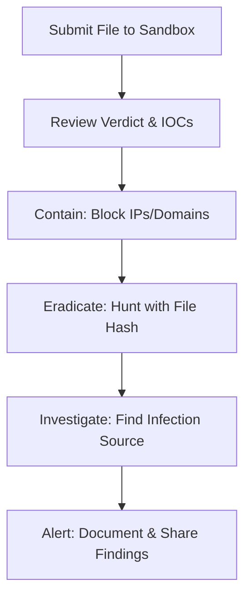

# Malware Sandbox Analysis with Hybrid-Analysis

A practical introduction to dynamic malware analysis using the free Hybrid-Analysis sandbox. This guide walks through the process of submitting a sample, interpreting the report, and understanding the core cybersecurity workflow from detection to response.

## Overview

**Hybrid-Analysis** is a powerful online sandbox that provides automated static, dynamic, and memory analysis of suspicious files. It's an essential tool for security analysts for quick triage and IOC extraction.

## Key Concepts Learned

-   **Sandboxing:** Executing code in an isolated, safe environment.
-   **IOCs (Indicators of Compromise):** Forensic evidence used to identify malicious activity (e.g., hashes, IPs, domains).
-   **MITRE ATT&CK Framework:** A curated knowledge base of adversary tactics and techniques. Hybrid-Analysis maps findings to this framework.
-   **The Analyst Workflow:** From submission to triage and response.

## Practical Example: The EICAR Test File

To safely learn the platform, you can submit the standard **EICAR Anti-Virus Test File**. This is a harmless text string that all security products are programmed to detect as if it were a virus. It's the perfect tool for safe practice.

### Sample Analysis Report

After submitting the EICAR file, Hybrid-Analysis correctly identifies it as malicious, providing a great example of a full report for a known-bad file.


**Key Report Sections Shown:**
1.  **Verdict & Score:** `Malicious` with a `100/100` threat score.
2.  **AV Detection:** Labeled as `Dos/Eicar_Test_File` by multiple engines.
3.  **File Information:** Shows the SHA256 hash and other file details.

## Walkthrough: Key Findings in a Real Report

For a realistic example, here are the condensed key findings from a real malware sample (`invoice_scan.exe`):

### 1. Overview & Verdict
*   **Verdict:** `Malicious`
*   **Threat Score:** `100/100`
*   **AV Detection:** `Win32.Trojan.Generic` (49/69 AVs detected it)
*   **The Takeaway:** Immediate confirmation the file is malicious.

### 2. Network Communications (Critical for IOC Blocking)
*   **Domains Contacted:** `microsoft-update[.]com` (Malicious), `secure-file-download[.]org` (Suspicious)
*   **IP Address:** `185.159.82[.]13`
*   **The Takeaway:** The malware is attempting to download more tools and "phone home". These IOCs must be blocked immediately.

### 3. MITRE ATT&CK Techniques
Hybrid-Analysis maps behavior to the [MITRE ATT&CK](https://attack.mitre.org/) framework, explaining the adversary's playbook.

| Tactic | Technique | Description |
| :--- | :--- | :--- |
| **Persistence** | [T1547.001: Boot or Logon Autostart Execution](https://attack.mitre.org/techniques/T1547/001/) | Modified registry to run on startup. |
| **Defense Evasion** | [T1055: Process Injection](https://attack.mitre.org/techniques/T1055/) | Hid code in a legitimate `svchost.exe` process. |
| **Discovery** | [T1033: System Owner/User Discovery](https://attack.mitre.org/techniques/T1033/) | Executed `whoami` to discover user context. |

**The Takeaway:** The malware is sophisticated, aiming to stay on the system, hide its activity, and gather information.

## From Analysis to Action: The Analyst's Response

A "malicious" verdict triggers a standard response workflow:



1.  **Containment:** Immediately block the identified IOCs (IPs, domains) at the firewall and proxy.
2.  **Eradication:** Use the file's **SHA256 hash** to hunt for and remove the infection across the network.
3.  **Investigation:** Find the infection source (e.g., a phishing email) by searching logs for the filename.
4.  **Alerting:** Document the findings and IOCs in a security alert for the team.

## Key Takeaways & Learning Outcomes

This project solidified my practical understanding of:

-   **The Purpose of Sandboxing:** To safely execute and observe malware in an isolated environment, separating theory from actionable evidence.
-   **IOC Extraction:** The ability to quickly identify and extract key indicators (hashes, IPs, domains) from an analysis report for immediate defensive action.
-   **MITRE ATT&CK Framework:** How to use this taxonomy to understand and communicate the tactics, techniques, and procedures (TTPs) of an adversary, moving beyond simple detection to comprehension.
-   **The Analyst's Workflow:** That analysis is only half the job; the other half is translating findings into a rapid, effective response to contain and eradicate a threat.

## How to Use This for Learning

1.  **Create the EICAR file yourself:**
    ```plaintext
    X5O!P%@AP[4\PZX54(P^)7CC)7}$EICAR-STANDARD-ANTIVIRUS-TEST-FILE!$H+H*
    ```
    Save the above string in a text file and rename it to `eicar_test.com`.

2.  **Submit it to Hybrid-Analysis:** Go to [https://www.hybrid-analysis.com](https://www.hybrid-analysis.com), create a free account, and submit your file.

3.  **Analyze the Report:** Use the report generated to practice identifying key IOCs and understanding the analysis output.

## Disclaimer

This is for educational purposes only. Always exercise caution and ensure you have explicit permission before analyzing any files that are not your own. The EICAR file is the only safe file you should submit for practice.
```

